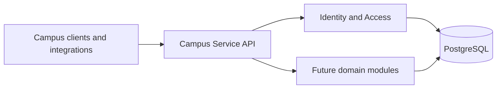
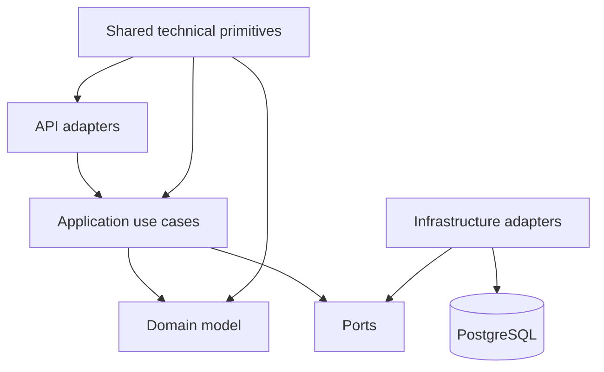

# Architecture

## Status of This Document

**Confirmed:** Campus Service is a Spring Boot 3.5.16 modular monolith with base package `com.campus`, PostgreSQL, and Flyway.

**Confirmed:** JWT authentication and the token lifecycle are implemented for Identity. Administrator user management follows accepted [ADR 0004](decisions/0004-admin-user-management-policy.md).

## System Context

Campus Service will provide a backend platform for university operations. The first implemented capability will be Identity and Access; later modules will cover student, faculty and staff, academic, dormitory, finance, and selected supporting capabilities.

The diagram describes the implemented modular direction. Phase 1B includes the Identity module with authentication and administrator user management.

## Modular Monolith

The initial system is one deployable application with modules organized by business capability. This avoids network and operational complexity while allowing domain boundaries to be tested in real use. See [ADR 0001](decisions/0001-modular-monolith-first.md).

### Proposed Module Boundaries

- `shared`: narrowly scoped cross-cutting primitives, error conventions, and shared technical support; it must not become a dumping ground for domain logic.
- `identity`: users, roles, credentials, authentication, and authorization.
- Future modules: `student`, `faculty`, `academic`, `dormitory`, `finance`, and supporting modules when their scope is approved.

A module owns its application logic, domain model, persistence mapping, and external API adapters. Cross-module access goes through explicit application-facing contracts, not repositories, entities, or database tables from another module.

## Dependency Direction

Dependencies point inward: API and infrastructure code depend on application and domain code; application code coordinates use cases; domain code expresses business rules and should not depend on HTTP, JPA, Spring MVC, or security adapter details. Shared code may be used only when it has no ownership in a specific business domain.

## Layer Responsibilities

- **API:** HTTP request/response mapping, input validation, authentication entry points, and OpenAPI exposure.
- **Application:** use-case orchestration, transaction boundaries, authorization decisions, and module contracts.
- **Domain:** business rules, domain terminology, invariants, and events.
- **Infrastructure:** JPA adapters, database access, JWT implementation, external integrations, and framework configuration.

The exact source layout is proposed and will be validated during Phase 1. It must not be treated as an implemented package structure.

## Security Direction

Spring Security with JWT-based authentication is implemented for Identity. `/api/v1/admin/**` requires `ROLE_ADMIN`, while the application layer uses the validated JWT subject UUID as the mutation actor. Authorization is enforced at both boundaries. Token signing, expiry, refresh, and revocation follow accepted ADR 0003; administrator management follows ADR 0004.

## Database Ownership

PostgreSQL is the confirmed relational database direction. Each module owns its tables and migrations. It may query only data it owns directly; cross-module data needs should use an explicit module contract or a deliberately designed read model. Schema changes are versioned through Flyway. See [ADR 0002](decisions/0002-database-and-migration.md).

## Domain Events

Modules may publish in-process domain or application events for decoupled local reactions after a concrete use case exists. Event publication must preserve transaction and failure semantics. A message broker is not part of the initial architecture; no Kafka or other broker is required in Phase 0 or Phase 1.

## Future Service Extraction

A module may be extracted only after evidence supports it, such as independent scaling needs, separately owned release cadence, bounded operational failure, or a proven integration boundary. Extraction requires an explicit API or event contract, data ownership plan, observability plan, migration path, and an ADR. Team preference alone is insufficient.
