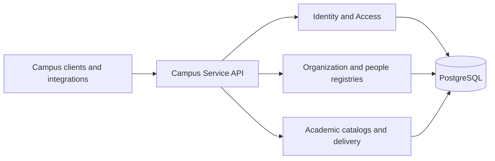
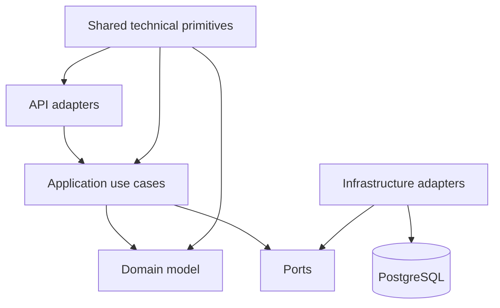

# Architecture

## Status of This Document

**Confirmed:** Campus Service is a Spring Boot 3.5.16 modular monolith with base package `com.campus`, PostgreSQL, and Flyway.

**Confirmed:** JWT authentication and the token lifecycle are implemented for Identity. Administrator user management follows accepted [ADR 0004](decisions/0004-admin-user-management-policy.md). Phase 3A adds Program/Course catalogs owned by `academic`; Phase 3B adds terms, offerings and class sections. Organization ownership uses the Organization application service and faculty assignment uses the Personnel application service. No cross-module persistence imports are introduced. Phase 2 adds Organization Unit, Student Registry, and Faculty/Staff Registry modules with optional Identity links, audited administrative mutations, and consistent administrative search APIs.

## System Context

Campus Service will provide a backend platform for university operations. Implemented capabilities cover Identity, organization and people registries, Academic catalogs/delivery and administrative enrollment; later use cases cover selected campus operations.

```mermaid
flowchart LR
    Client[Campus clients and integrations] --> API[Campus Service API]
    API --> IAM[Identity and Access]
    API --> Registry[Organization and people registries]
    API --> Academic[Academic catalogs and delivery]
    IAM --> DB[(PostgreSQL)]
    Registry --> DB
    Academic --> DB
```

The diagram describes the implemented modular direction. Phase 1B includes the Identity module with authentication and administrator user management; Phase 2 includes the organization and people registry foundations; Phase 3A includes Program/Course catalogs; Phase 3B includes terms, offerings and sections; Phase 3C includes administrative enrollment through the Student application contract.

## Modular Monolith

The initial system is one deployable application with modules organized by business capability. This avoids network and operational complexity while allowing domain boundaries to be tested in real use. See [ADR 0001](decisions/0001-modular-monolith-first.md).

### Proposed Module Boundaries

- `shared`: narrowly scoped cross-cutting primitives, error conventions, and shared technical support; it must not become a dumping ground for domain logic.
- `identity`: users, roles, credentials, authentication, and authorization.
- `organization`: reference organization units used by approved registry modules.
- `student`: student profiles and their optional Identity link.
- `personnel`: faculty and staff profiles and their optional Identity link.
- `academic`: Program/Course catalog, terms, course offerings, class sections and administrative enrollment.
- Future modules: `dormitory`, `finance`, and supporting modules when their scope is approved.

A module owns its application logic, domain model, persistence mapping, and external API adapters. Cross-module access goes through explicit application-facing contracts, not repositories, entities, or database tables from another module.

```mermaid
flowchart TB
    API[API adapters] --> APP[Application use cases]
    APP --> DOMAIN[Domain model]
    APP --> PORTS[Ports]
    INFRA[Infrastructure adapters] --> PORTS
    INFRA --> DB[(PostgreSQL)]
    SHARED[Shared technical primitives] --> API
    SHARED --> APP
    SHARED --> DOMAIN
```

## Dependency Direction

Dependencies point inward: API and infrastructure code depend on application and domain code; application code coordinates use cases; domain code expresses business rules and should not depend on HTTP, JPA, Spring MVC, or security adapter details. Shared code may be used only when it has no ownership in a specific business domain.

## Layer Responsibilities

- **API:** HTTP request/response mapping, input validation, authentication entry points, and OpenAPI exposure.
- **Application:** use-case orchestration, transaction boundaries, authorization decisions, and module contracts.
- **Domain:** business rules, domain terminology, invariants, and events.
- **Infrastructure:** JPA adapters, database access, JWT implementation, external integrations, and framework configuration.

The implemented modules follow API, application, domain and infrastructure packages. Future modules must preserve the same ownership boundaries.

## Security Direction

Spring Security with JWT-based authentication is implemented for Identity. `/api/v1/admin/**` requires `ROLE_ADMIN`, while the application layer uses the validated JWT subject UUID as the mutation actor. Authorization is enforced at both boundaries. Token signing, expiry, refresh, and revocation follow accepted ADR 0003; administrator management follows ADR 0004.

## Database Ownership

PostgreSQL is the confirmed relational database direction. Each module owns its tables and migrations. It may query only data it owns directly; cross-module data needs should use an explicit module contract or a deliberately designed read model. Schema changes are versioned through Flyway. See [ADR 0002](decisions/0002-database-and-migration.md).

## Domain Events

Modules may publish in-process domain or application events for decoupled local reactions after a concrete use case exists. Event publication must preserve transaction and failure semantics. A message broker is not part of the initial architecture; no Kafka or other broker is required in Phase 0 or Phase 1.

## Future Service Extraction

A module may be extracted only after evidence supports it, such as independent scaling needs, separately owned release cadence, bounded operational failure, or a proven integration boundary. Extraction requires an explicit API or event contract, data ownership plan, observability plan, migration path, and an ADR. Team preference alone is insufficient.

## Academic delivery invariants

A course offering belongs to one term/course pair and retains its organization UUID; a class section belongs to one offering and owns its capacity and single faculty assignment. Academic owns the lifecycle checks. Delivery mutations lock term, then offering, then section where applicable to prevent concurrent parent closure and child opening. These are local database transactions within the monolith. The tradeoff is serialization of delivery mutations within a term; no load-test claim is made. Course/organization/faculty status is checked when opening and when relevant references are newly assigned; deactivation does not rewrite historical classes.

Historical upgrade validation scans only production entity packages present at its target version. V13 validation excludes delivery/enrollment; V16 validation includes delivery and excludes enrollment; V17 validation includes all currently implemented entities. Flyway remains disabled during exact-schema Hibernate validation.

## Enrollment invariants

Academic owns one retained enrollment per student/section pair. Only ENROLLED consumes capacity; WITHDRAWN may be restored using expectedVersion and full eligibility/capacity checks. Enrollment writes use the same term → offering → section lock order before counting seats or refreshing an existing enrollment. Student eligibility uses the Student application service, with no cross-module persistence lock; later deactivation does not rewrite enrollment history. Withdrawal is possible after closure. Direct SQL admission is unsupported and capacity is an application transaction invariant, rather than a database CHECK. See [ADR 0005](decisions/0005-enrollment-capacity-and-lifecycle.md) for tradeoffs and deferred scope.
