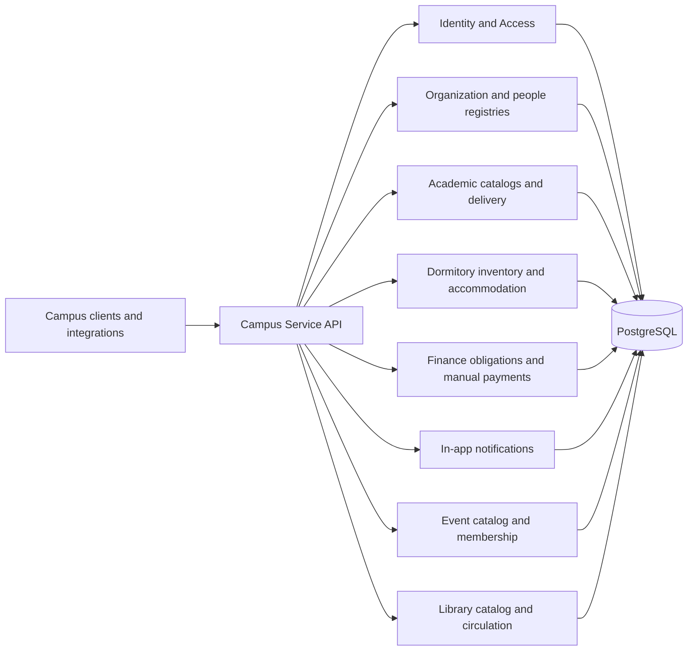
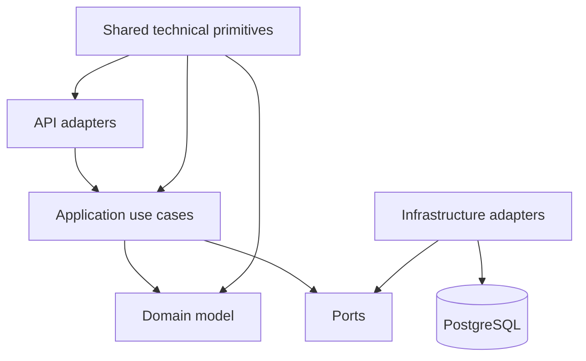

# Architecture

## Status of This Document

**Confirmed:** Campus Service is a Spring Boot 3.5.16 modular monolith with base package `com.campus`, PostgreSQL, and Flyway.

**Confirmed:** JWT authentication and the token lifecycle are implemented for Identity. Administrator user management follows accepted [ADR 0004](decisions/0004-admin-user-management-policy.md). Phase 3A adds Program/Course catalogs owned by `academic`; Phase 3B adds terms, offerings and class sections. Organization ownership uses the Organization application service and faculty assignment uses the Personnel application service. No cross-module persistence imports are introduced. Phase 2 adds Organization Unit, Student Registry, and Faculty/Staff Registry modules with optional Identity links, audited administrative mutations, and consistent administrative search APIs.

## System Context

Campus Service provides a backend platform for university operations. Implemented capabilities cover Identity, organization and people registries, Academic catalogs/delivery/enrollment, Dormitory inventory/accommodation and Finance fees/obligations/manual payments/reversal, in-app Notification, Event catalog/membership and Library circulation. Audit viewing remains an approved future slice; Library verification status is recorded in its review.

```mermaid
flowchart LR
    Client[Campus clients and integrations] --> API[Campus Service API]
    API --> IAM[Identity and Access]
    API --> Registry[Organization and people registries]
    API --> Academic[Academic catalogs and delivery]
    API --> Dormitory[Dormitory inventory and accommodation]
    API --> Finance[Finance obligations and manual payments]
    API --> Notification[In-app notifications]
    API --> Event[Event catalog and membership]
    API --> Library[Library catalog and circulation]
    IAM --> DB[(PostgreSQL)]
    Registry --> DB
    Academic --> DB
    Dormitory --> DB
    Finance --> DB
    Notification --> DB
    Event --> DB
    Library --> DB
```

The diagram describes the implemented modular direction. Phase 1B includes Identity authentication/admin management; Phase 2 organization and people registries; Phase 3 catalogs/delivery/enrollment/audit; Phase 4A Dormitory; Phase 4B1 Finance obligations. Enrollment, accommodation and Finance eligibility use the Student application contract.

## Modular Monolith

The initial system is one deployable application with modules organized by business capability. This avoids network and operational complexity while allowing domain boundaries to be tested in real use. See [ADR 0001](decisions/0001-modular-monolith-first.md).

### Proposed Module Boundaries

- `shared`: narrowly scoped cross-cutting primitives, error conventions, and shared technical support; it must not become a dumping ground for domain logic.
- `identity`: users, roles, credentials, authentication, and authorization.
- `organization`: reference organization units used by approved registry modules.
- `student`: student profiles and their optional Identity link.
- `personnel`: faculty and staff profiles and their optional Identity link.
- `academic`: Program/Course catalog, terms, course offerings, class sections and administrative enrollment.
- `dormitory`: building/room/bed inventory, current accommodation assignments and atomic mutation audit (4A1/4A2).
- `finance`: VND fee definitions, immutable Student obligation snapshots, manual receipts/reversal and atomic mutation audit (4B1/4B2).
- `notification`: reusable text templates, draft/published snapshots, recipient-owned delivery/read acknowledgement and atomic mutation audit (5A); ACTIVE account eligibility uses IdentityUserDirectory without foreign persistence access. See ADR 0011.
- `event`: Event catalog, retained Student membership, self-service via current Identity link, ADMIN attendance, capacity protection and atomic audit (5B). Eligibility/ownership uses StudentAccountDirectory; see ADR 0012.
- `library`: titles/physical copies, ADMIN circulation, one OPEN loan per copy, retained returns and atomic audit (5C). ACTIVE Student eligibility uses StudentAccountDirectory; see ADR 0013.

A module owns its application logic, domain model, persistence mapping, and external API adapters. Cross-module access goes through explicit application-facing contracts, not repositories, entities, or database tables from another module.

```mermaid
flowchart TB
    API[API adapters] --> APP[Application use cases]
    APP --> DOMAIN[Domain model]
    APP --> PORTS[Ports]
    INFRA[Infrastructure adapters] --> PORTS
    INFRA --> DB[(PostgreSQL)]
    SHARED[Shared technical primitives] --> API
    SHARED --> APP
    SHARED --> DOMAIN
```

## Dependency Direction

Dependencies point inward: API and infrastructure code depend on application and domain code; application code coordinates use cases; domain code expresses business rules and should not depend on HTTP, JPA, Spring MVC, or security adapter details. Shared code may be used only when it has no ownership in a specific business domain.

## Layer Responsibilities

- **API:** HTTP request/response mapping, input validation, authentication entry points, and OpenAPI exposure.
- **Application:** use-case orchestration, transaction boundaries, authorization decisions, and module contracts.
- **Domain:** business rules, domain terminology, invariants, and events.
- **Infrastructure:** JPA adapters, database access, JWT implementation, external integrations, and framework configuration.

The implemented modules follow API, application, domain and infrastructure packages. Future modules must preserve the same ownership boundaries.

## Security Direction

Spring Security with JWT-based authentication is implemented for Identity. The HTTP boundary enforces `ROLE_ADMIN` for `/api/v1/admin/**`; administrative application entry points receive the validated JWT subject UUID as the mutation actor. Internal provisioning/fixture entry points are trusted server-side calls, not client interfaces. Token signing, expiry, refresh, and revocation follow accepted ADR 0003; administrator management follows ADR 0004.

## Database Ownership

PostgreSQL is the confirmed relational database direction. Each module owns its tables and migrations. It may query only data it owns directly; cross-module data needs should use an explicit module contract or a deliberately designed read model. Schema changes are versioned through Flyway. See [ADR 0002](decisions/0002-database-and-migration.md).

## Domain Events

Modules may publish in-process domain or application events for decoupled local reactions after a concrete use case exists. Event publication must preserve transaction and failure semantics. A message broker is not part of the initial architecture; no Kafka or other broker is required in Phase 0 or Phase 1.

## Future Service Extraction

A module may be extracted only after evidence supports it, such as independent scaling needs, separately owned release cadence, bounded operational failure, or a proven integration boundary. Extraction requires an explicit API or event contract, data ownership plan, observability plan, migration path, and an ADR. Team preference alone is insufficient.

## Academic delivery invariants

A course offering belongs to one term/course pair and retains its organization UUID; a class section belongs to one offering and owns its capacity and single faculty assignment. Academic owns the lifecycle checks. Delivery mutations lock term, then offering, then section where applicable to prevent concurrent parent closure and child opening. These are local database transactions within the monolith. The tradeoff is serialization of delivery mutations within a term; no load-test claim is made. Course/organization/faculty status is checked when opening and when relevant references are newly assigned; deactivation does not rewrite historical classes.

Historical upgrade validation scans only production entity packages present at its target version. V13 validation excludes delivery/enrollment/audit; V16 includes delivery and excludes enrollment/audit; V17 includes enrollment and excludes audit; V18 retains its original 16 entities and excludes Dormitory; V19 retains 20 entities and excludes the separate assignment persistence package; V20 retains 21 and excludes Finance; V21 retains 24 and excludes payment persistence; V22 includes 25. Flyway remains disabled during exact-schema Hibernate validation.

## Enrollment invariants

Academic owns one retained enrollment per student/section pair. Only ENROLLED consumes capacity; WITHDRAWN may be restored using expectedVersion and full eligibility/capacity checks. Enrollment writes use the same term → offering → section lock order before counting seats or refreshing an existing enrollment. Student eligibility uses the Student application service, with no cross-module persistence lock; later deactivation does not rewrite enrollment history. Withdrawal is possible after closure. Direct SQL admission is unsupported and capacity is an application transaction invariant, rather than a database CHECK. See [ADR 0005](decisions/0005-enrollment-capacity-and-lifecycle.md) for tradeoffs and deferred scope.

## Academic mutation audit and query review

All Academic HTTP create/update operations use AcademicAdministrationService, whose transaction encloses the original application use case and synchronous AcademicAudit persistence. Actor UUID comes from the JWT principal. Audit records contain resource UUID/type, action, resulting version, time and status-only JSONB metadata; they contain no arbitrary request snapshots or contact/credential data. Failure rolls back both writes and returns the safe AUDIT_WRITE_FAILED error. The Academic-owned audit schema has an actor FK but no polymorphic target FK or public audit query interface. See [ADR 0006](decisions/0006-academic-mutation-audit.md).

Enrollment occupancy and Student/status queries have selective index-plan evidence on synthetic PostgreSQL fixtures, without planner overrides. Substring search with a leading wildcard may scan; no claim is made that the catalog's B-tree uniqueness index optimizes arbitrary substring searches. Further indexing or narrower locks must be justified by actual workload measurements.

## Dormitory inventory

Dormitory owns three inventory tables, assignments and its mutation audit. Immutable UUID parent links form building → room → bed; lifecycle locks use that order, followed by assignment when releasing. Active child creation/activation requires active ancestors, and deactivation refuses active immediate children or an occupied bed. Partial unique indexes enforce one ASSIGNED record per Student and per bed, including competition across buildings. RELEASED frees occupancy and preserves history; later stays use a new UUID. Eligibility reads the Student application contract without importing its persistence internals; Student status is checked at the operation decision, not frozen across modules. All Dormitory mutations require an actor and synchronous audit; HTTP enforces ADMIN and obtains that actor from the JWT principal. Shared inventory queries use fixed resource kinds. No future booking intervals or billing are modeled. See [ADR 0007](decisions/0007-dormitory-inventory-and-assignment-boundary.md) and [ADR 0008](decisions/0008-accommodation-current-place-and-release.md).

## Finance obligations

Finance owns fee definitions, Student charges, manual receipts and synchronous status-only audit. VND amounts use BigDecimal and NUMERIC with integer/range CHECKs; a declared database scale is avoided because it could round fractions before the CHECK. Charge creation locks an ACTIVE fee, checks ACTIVE Student through its application contract and stores immutable fee/code/name/amount/currency/due-date snapshots. Fee changes and reference deactivation preserve history. Payment/reversal/cancellation refresh and lock charge first, then receipt for reversal. Payments cannot exceed outstanding; cancellation requires zero effective RECORDED payments. Reversal is full and terminal with retained reason/history. Successful payment/reversal explicitly increments charge version; balance/version reads use one aggregate query, avoiding mutable counters or torn reads. CANCELLED preserves original amount but has zero collectible outstanding. Aggregate safeguards are application transaction invariants; SQL constraints protect local receipt shape/money/uniqueness/references. No gateway, automatic Academic/Dormitory billing or ledger. See [ADR 0009](decisions/0009-finance-vnd-obligations-and-snapshots.md) and [ADR 0010](decisions/0010-manual-payments-and-charge-balance.md).

## Operations query and response consistency

Dormitory inventory/assignment and Finance writes return refreshed persisted timestamps and versions, matching subsequent reads at PostgreSQL precision. The Operations query-plan test exercises the same selective predicate/aggregate shapes as the adapters: parent inventory, current occupancy, Student assignment history, Student/fee charges and charge payment totals/balance. With synthetic fixtures, ANALYZE and the default PostgreSQL planner, existing parent-prefixed inventory indexes, partial current-place uniqueness indexes and Student/status or charge/status indexes serve these queries. Parent inventory may use either its unique code index or status index. This does not establish production latency or optimize arbitrary substring search; no extra index or distributed infrastructure is introduced. See [Phase 4 closure review](reviews/phase-4-final-review.md).

## Notification ownership and upgrade validation

Phase 5A is reviewed PASS. Notification publication is an atomic local delivery to explicit active account UUIDs; it is not an external transport queue. Inbox ownership comes exclusively from the authenticated subject. Published text is immutable, repeated read acknowledgement is idempotent, and metadata contains status only. Page content uses one bounded batch query rather than a notice lookup per delivery. Identity eligibility uses a database status projection to avoid stale first-level-cache entities. Eligibility is checked at the operation decision; no cross-module lock is claimed.

V23 adds four Notification tables/entities. Historical V22 validation explicitly scans its original 25 entity packages; the genuine V22→V23 test validates all 29 entities on the same upgraded database/public schema with Flyway disabled and ddl-auto=validate. Future modules must freeze that historical scan before introducing new entities. Delivered V1–V22 remain immutable.
## Event membership ownership

Event 5B is reviewed PASS: catalog and retained unique Student/event membership, linked-account owner APIs plus ADMIN attendance, OPEN-only manual admission gate and same-record expectedVersion restoration. StudentAccountDirectory supplies fresh scalar UUID/status eligibility without foreign persistence or locks. Event is locked/refreshed before membership; count REGISTERED/ATTENDED under that lock serializes admissions/restores and capacity reductions. Audit is synchronous/status-only, cancellation frees capacity, attendance is terminal and consumes a seat. Direct SQL bypass is not an aggregate capacity guarantee; no scheduler/fees/automatic Notification integration. ADR 0012 records scope and limits. V24 adds three entities; exact upgraded-schema validation now has 32 entities, while historical V23 retains 29. Freeze historical V24 scanning before adding Library entities.

## Library circulation

Library owns title/copy catalogs and retained OPEN/RETURNED loans. ADMIN mutation actors come from JWT; clients cannot choose loan dates. The server defaults to exactly 14 elapsed days. A partial unique index protects one OPEN loan per copy. Refreshed title→copy→loan locks serialize admission against catalog deactivation and return; conservative title-level serialization is an explicit local-project tradeoff. Return is permitted after reference deactivation or overdue and retains immutable association/original dates; next loan uses a new UUID. Student status is a fresh decision-time read through Student's own application contract. All six mutation types write status-only audit synchronously and rollback together. No reservations, renewals, fines, Student self-borrow or automatic Finance/Notification integration.

V25 adds four Library entities. The populated exact V24→V25 validation checks all 36 production entities with Flyway disabled and ddl-auto=validate; historical V24 now explicitly retains its 32-entity scan. No previous migration is edited. See [ADR 0013](decisions/0013-library-circulation-and-history.md) and [Library review](reviews/phase-5c-library-review.md) for executed gates.
