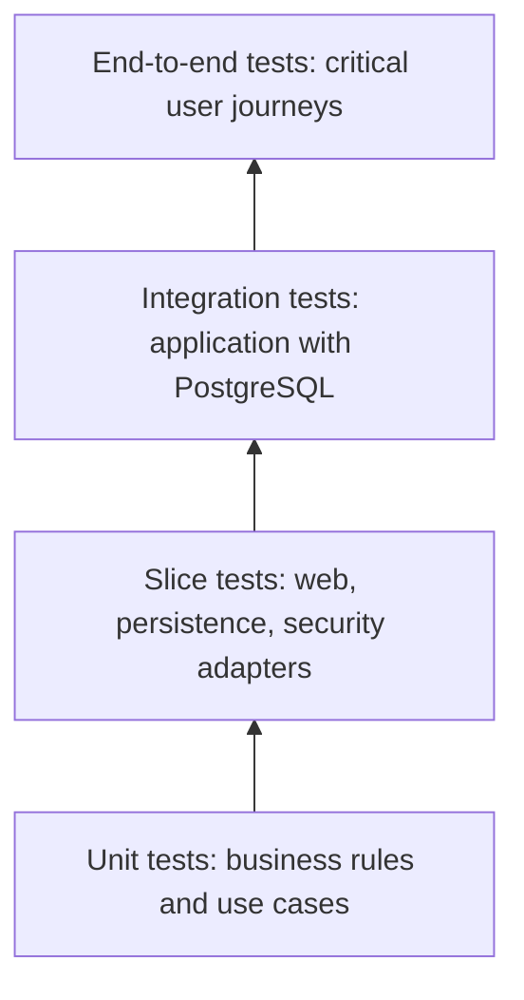

# Testing Strategy

## Principles

Tests provide evidence that behavior, security boundaries, and schema changes work as intended. Campus Service will favor fast tests close to the business rule, with fewer broader tests for framework and infrastructure behavior. No coverage percentage is claimed or required before a measurement tool and threshold are deliberately adopted.

## Testing Pyramid

## Test Responsibilities

- **Unit tests:** validate domain rules and application use cases without Spring or a database where practical.
- **Slice tests:** validate focused framework integrations, such as MVC request handling, validation, JPA mapping, or security configuration.
- **Integration tests:** validate modules working with real infrastructure behavior, especially PostgreSQL, migrations, persistence, and authorization boundaries.
- **End-to-end tests:** cover a small set of critical externally visible journeys once the application and stable API exist; they are not a Phase 0 deliverable.

## Current Tooling

Phase 1B uses JUnit 5, Spring Boot Test, MockMvc, Testcontainers PostgreSQL, and Flyway. The verified Windows command is `./mvnw.cmd clean verify` when run from PowerShell as `.\mvnw.cmd clean verify`.

The 58 tests verified by `./mvnw.cmd clean verify` cover the health endpoint, Flyway migrations through V5, authentication and authorization boundaries, administrator user-management flows, multi-session HTTP revocation, and audit-failure rollback. Integration tests run against PostgreSQL Testcontainers and do not connect to a developer's local database.

## Authentication and Authorization

Identity and Access tests must cover successful and failed authentication, invalid or expired token behavior once token handling exists, anonymous access restrictions, and role-based allow/deny cases for protected capabilities. Tests must assert that unauthorized requests are rejected, not merely that authorized requests succeed.

## Database Migration Verification

Every persistence change must include migration verification. Integration tests should start a clean PostgreSQL instance through Testcontainers, apply Flyway migrations, and exercise affected persistence behavior. A migration failure is a release blocker.

## Naming Convention

Use behavior-oriented names that state the condition and expected result, such as `createsUserWhenRequestIsValid` or `deniesEnrollmentReadWhenCallerLacksRole`. Follow the project test style once it is established rather than introducing competing conventions.

## Acceptable Evidence

Evidence includes the exact command run, its verified result, the test scope, and any known gaps. If tests cannot run because the Maven project or required infrastructure does not yet exist, state that plainly. Never fabricate execution results, test counts, coverage, or environment status.
