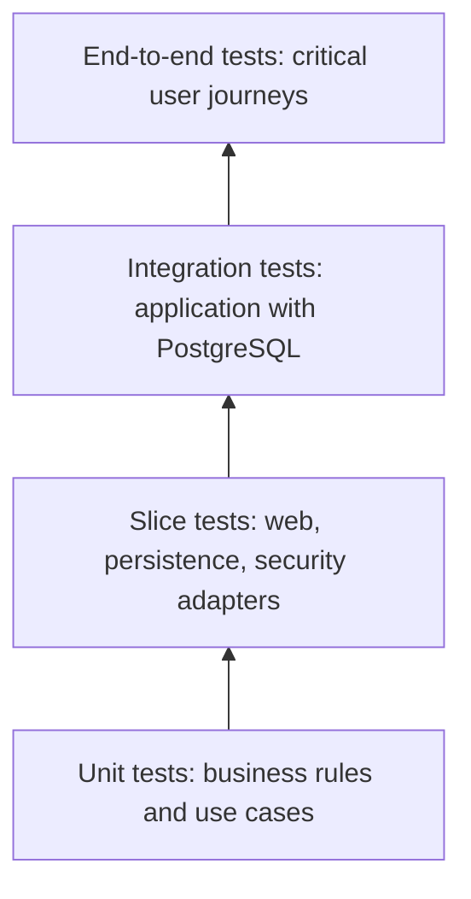

# Testing Strategy

## Principles

Tests provide evidence that behavior, security boundaries, and schema changes work as intended. Campus Service will favor fast tests close to the business rule, with fewer broader tests for framework and infrastructure behavior. No coverage percentage is claimed or required before a measurement tool and threshold are deliberately adopted.

## Testing Pyramid

```mermaid
flowchart BT
    Unit[Unit tests: business rules and use cases]
    Slice[Slice tests: web, persistence, security adapters]
    Integration[Integration tests: application with PostgreSQL]
    E2E[End-to-end tests: critical user journeys]
    Unit --> Slice --> Integration --> E2E
```

## Test Responsibilities

- **Unit tests:** validate domain rules and application use cases without Spring or a database where practical.
- **Slice tests:** validate focused framework integrations, such as MVC request handling, validation, JPA mapping, or security configuration.
- **Integration tests:** validate modules working with real infrastructure behavior, especially PostgreSQL, migrations, persistence, and authorization boundaries.
- **End-to-end tests:** cover a small set of critical externally visible journeys once the application and stable API exist; they are not a Phase 0 deliverable.

## Current Tooling

Phase 1, the Phase 2 registries and Phase 3A catalogs use JUnit 5, Spring Boot Test, MockMvc, Testcontainers PostgreSQL, and Flyway. The verified Windows command is `./mvnw.cmd clean verify` when run from PowerShell as `.\mvnw.cmd clean verify`.

The 121 tests verified by `./mvnw.cmd clean verify` on 2026-10-03 cover health and readiness probes, production-profile configuration, Flyway migrations through V13 including V4-to-V5, V8-to-V10, V10-to-V11 and V11-to-V13 upgrades, authentication and authorization boundaries, administrator user-management flows, multi-session HTTP revocation, audit-failure rollback, the organization, student, and faculty/staff registries, and Program/Course catalog validation, authorization, concurrent updates and paginated queries. Integration tests run against PostgreSQL Testcontainers and do not connect to a developer's local database.

## Authentication and Authorization

Identity and Access tests must cover successful and failed authentication, invalid or expired token behavior once token handling exists, anonymous access restrictions, and role-based allow/deny cases for protected capabilities. Tests must assert that unauthorized requests are rejected, not merely that authorized requests succeed.

## Database Migration Verification

Every persistence change must include migration verification. Integration tests should start a clean PostgreSQL instance through Testcontainers, apply Flyway migrations, and exercise affected persistence behavior. A migration failure is a release blocker.

`FlywayV4ToV5UpgradeIntegrationTest` first migrates to V4, inserts legacy users and role assignments, and then applies only V5. Its six tests verify explicit space/tab/newline/carriage-return/vertical-tab/form-feed normalization, short/blank fallbacks, truncation and Unicode boundaries, preservation of identity fields and roles, display-name constraints, row-version defaults and nullability, guard seed/constraints and the production lock query across commit and rollback, and audit columns/defaults/foreign keys/index and valid/invalid inserts. A minimal JPA context validates all production entities against that same upgraded schema with Flyway disabled and confirms migration history is unchanged.

Verified on 2026-09-24:

- `.\mvnw.cmd "-Dtest=FlywayV4ToV5UpgradeIntegrationTest,IdentityPersistenceIntegrationTest" test`: BUILD SUCCESS; 15 tests, no failures/errors/skips; 36.025 seconds.
- `.\mvnw.cmd clean verify`: BUILD SUCCESS; 70 tests, no failures/errors/skips; 1 minute 43 seconds.

Verified for Phase 2D on 2026-09-24:

- `.\mvnw.cmd "-Dtest=FlywayV8ToV10PeopleRegistryUpgradeIntegrationTest" test`: BUILD SUCCESS; 2 tests, no failures/errors/skips; 21.507 seconds.
- `.\mvnw.cmd "-Dtest=PeopleRegistrySearchIntegrationTest,PeopleRegistryAuditIntegrationTest,FlywayV10ToV11PeopleAuditUpgradeIntegrationTest" test`: BUILD SUCCESS; 5 tests, no failures/errors/skips.
- `.\mvnw.cmd clean verify`: BUILD SUCCESS; 90 tests, no failures/errors/skips; 3 minutes 52 seconds.

`FlywayV8ToV10PeopleRegistryUpgradeIntegrationTest` migrates a disposable PostgreSQL schema to V8, inserts legacy registry and identity records, then applies V9 and V10. It verifies preserved records, case-insensitive identifier uniqueness, nullable optional Identity links, foreign keys and unique link indexes, and a Hibernate `ddl-auto=validate` context that uses the upgraded schema with Flyway disabled.

`FlywayV10ToV11PeopleAuditUpgradeIntegrationTest` migrates a disposable schema to V10 and then applies only V11. It verifies the approved audit columns, types, nullability, default, constraints, foreign key, index, valid and invalid writes, and Hibernate `ddl-auto=validate` with Flyway disabled against the exact upgraded schema. `PeopleRegistryAuditIntegrationTest` verifies audited Student and Faculty/Staff create/update operations and transactional rollback when audit persistence fails.

These successful runs required Docker named-pipe access outside the agent sandbox; the initial sandboxed focused run failed during Docker discovery before migration assertions ran.

## Phase 3A Verification

Verified on 2026-10-03 with Docker Desktop running:

- `.\mvnw.cmd "-Dtest=AcademicCatalogTest,AdminAcademicCatalogControllerIntegrationTest,FlywayV11ToV13AcademicCatalogUpgradeIntegrationTest" test`: BUILD SUCCESS; 31 tests, no failures/errors/skips; 3 minutes 46 seconds.
- `.\mvnw.cmd clean verify`: BUILD SUCCESS; 121 tests, no failures/errors/skips; 5 minutes 29 seconds. This run covers the final source, including SQLSTATE classification and the JPA pagination offset bound added during review.

The 31 Academic tests comprise 9 domain cases, 16 API cases and 6 upgrade/schema cases. They cover six-character boundary whitespace and Unicode length, credit boundaries, ADMIN-only operations, create/read/PUT, stale and duplicate update rollback, two competing updates (one succeeds, one returns 409), missing/inactive ownership, error contracts, database pagination/search/status/sort and invalid query parameters.

`FlywayV11ToV13AcademicCatalogUpgradeIntegrationTest` inserts representative V11 identity/role/organization/student/personnel/audit fixtures, captures every field and original migration history, then applies exactly V12/V13. It verifies column types, approved lengths, nullability, defaults, primary/unique/foreign keys, indexes, valid boundary writes and SQLSTATE rejection for invalid writes. A minimal JPA context scans production entities and runs `ddl-auto=validate` against that same upgraded public schema with Flyway disabled. Migration history and existing records remain unchanged. V1–V11 were not edited.

Final review covers error/transaction/version behavior, bounded database queries, module imports, migrations, tests and staged whitespace checks. Academic mutation audit, terms, sections and enrollment remain outside Phase 3A.

## Naming Convention

Use behavior-oriented names that state the condition and expected result, such as `createsUserWhenRequestIsValid` or `deniesEnrollmentReadWhenCallerLacksRole`. Follow the project test style once it is established rather than introducing competing conventions.

## Acceptable Evidence

Evidence includes the exact command run, its verified result, the test scope, and any known gaps. If tests cannot run because the Maven project or required infrastructure does not yet exist, state that plainly. Never fabricate execution results, test counts, coverage, or environment status.
