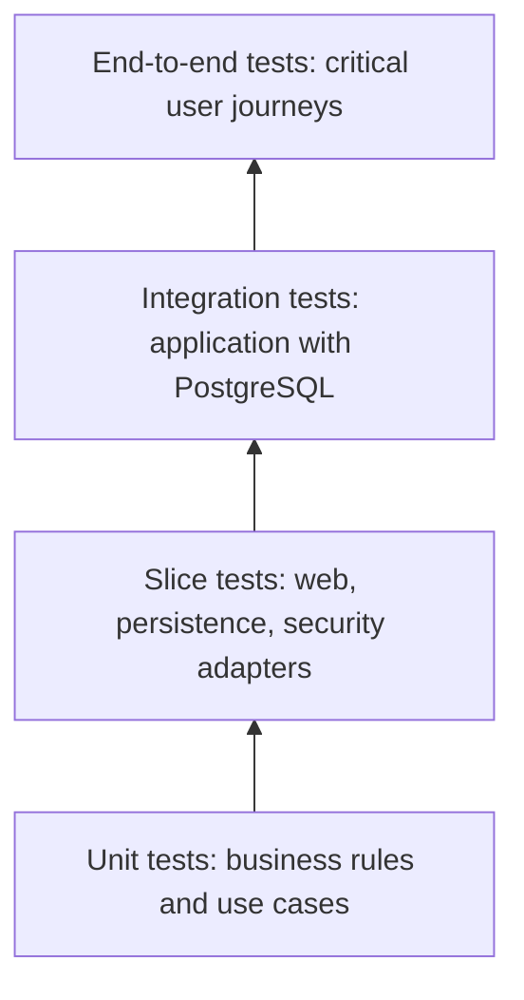

# Testing Strategy

## Principles

Tests provide evidence that behavior, security boundaries, and schema changes work as intended. Campus Service will favor fast tests close to the business rule, with fewer broader tests for framework and infrastructure behavior. No coverage percentage is claimed or required before a measurement tool and threshold are deliberately adopted.

## Testing Pyramid

```mermaid
flowchart BT
    Unit[Unit tests: business rules and use cases]
    Slice[Slice tests: web, persistence, security adapters]
    Integration[Integration tests: application with PostgreSQL]
    E2E[End-to-end tests: critical user journeys]
    Unit --> Slice --> Integration --> E2E
```

## Test Responsibilities

- **Unit tests:** validate domain rules and application use cases without Spring or a database where practical.
- **Slice tests:** validate focused framework integrations, such as MVC request handling, validation, JPA mapping, or security configuration.
- **Integration tests:** validate modules working with real infrastructure behavior, especially PostgreSQL, migrations, persistence, and authorization boundaries.
- **End-to-end tests:** cover a small set of critical externally visible journeys once the application and stable API exist; they are not a Phase 0 deliverable.

## Current Tooling

Phase 1, the Phase 2 registries and Phase 3 Academic foundations use JUnit 5, Spring Boot Test, MockMvc, Testcontainers PostgreSQL, and Flyway. The verified Windows command is `./mvnw.cmd clean verify` when run from PowerShell as `.\mvnw.cmd clean verify`.

The Phase 3 baseline of 208 tests verified by `./mvnw.cmd clean verify` on 2026-10-04 cover health and readiness probes, production-profile configuration, Flyway migrations through V18 including V4-to-V5, V8-to-V10, V10-to-V11, V11-to-V13, V13-to-V16, V16-to-V17 and V17-to-V18 upgrades, authentication and authorization boundaries, administrator user-management flows, multi-session HTTP revocation, audit-failure rollback, the organization, student, and faculty/staff registries, Program/Course catalog validation, authorization, concurrent updates and paginated queries, term/offering/section lifecycle and faculty-assignment rules, administrative enrollment with capacity, withdrawal/re-enrollment and competing transaction protection, transactional Academic mutation audit, OpenAPI security, selective PostgreSQL query plans and cross-module Java dependency guards. Integration tests run against PostgreSQL Testcontainers and do not connect to a developer's local database.

## Authentication and Authorization

Identity and Access tests must cover successful and failed authentication, invalid or expired token behavior once token handling exists, anonymous access restrictions, and role-based allow/deny cases for protected capabilities. Tests must assert that unauthorized requests are rejected, not merely that authorized requests succeed.

## Database Migration Verification

Every persistence change must include migration verification. Integration tests should start a clean PostgreSQL instance through Testcontainers, apply Flyway migrations, and exercise affected persistence behavior. A migration failure is a release blocker.

`FlywayV4ToV5UpgradeIntegrationTest` first migrates to V4, inserts legacy users and role assignments, and then applies only V5. Its six tests verify explicit space/tab/newline/carriage-return/vertical-tab/form-feed normalization, short/blank fallbacks, truncation and Unicode boundaries, preservation of identity fields and roles, display-name constraints, row-version defaults and nullability, guard seed/constraints and the production lock query across commit and rollback, and audit columns/defaults/foreign keys/index and valid/invalid inserts. A minimal JPA context validates all production entities against that same upgraded schema with Flyway disabled and confirms migration history is unchanged.

Verified on 2026-09-24:

- `.\mvnw.cmd "-Dtest=FlywayV4ToV5UpgradeIntegrationTest,IdentityPersistenceIntegrationTest" test`: BUILD SUCCESS; 15 tests, no failures/errors/skips; 36.025 seconds.
- `.\mvnw.cmd clean verify`: BUILD SUCCESS; 70 tests, no failures/errors/skips; 1 minute 43 seconds.

Verified for Phase 2D on 2026-09-24:

- `.\mvnw.cmd "-Dtest=FlywayV8ToV10PeopleRegistryUpgradeIntegrationTest" test`: BUILD SUCCESS; 2 tests, no failures/errors/skips; 21.507 seconds.
- `.\mvnw.cmd "-Dtest=PeopleRegistrySearchIntegrationTest,PeopleRegistryAuditIntegrationTest,FlywayV10ToV11PeopleAuditUpgradeIntegrationTest" test`: BUILD SUCCESS; 5 tests, no failures/errors/skips.
- `.\mvnw.cmd clean verify`: BUILD SUCCESS; 90 tests, no failures/errors/skips; 3 minutes 52 seconds.

`FlywayV8ToV10PeopleRegistryUpgradeIntegrationTest` migrates a disposable PostgreSQL schema to V8, inserts legacy registry and identity records, then applies V9 and V10. It verifies preserved records, case-insensitive identifier uniqueness, nullable optional Identity links, foreign keys and unique link indexes, and a Hibernate `ddl-auto=validate` context that uses the upgraded schema with Flyway disabled.

`FlywayV10ToV11PeopleAuditUpgradeIntegrationTest` migrates a disposable schema to V10 and then applies only V11. It verifies the approved audit columns, types, nullability, default, constraints, foreign key, index, valid and invalid writes, and Hibernate `ddl-auto=validate` with Flyway disabled against the exact upgraded schema. `PeopleRegistryAuditIntegrationTest` verifies audited Student and Faculty/Staff create/update operations and transactional rollback when audit persistence fails.

These successful runs required Docker named-pipe access outside the agent sandbox; the initial sandboxed focused run failed during Docker discovery before migration assertions ran.

## Phase 3A Verification

Verified on 2026-10-03 with Docker Desktop running:

- `.\mvnw.cmd "-Dtest=AcademicCatalogTest,AdminAcademicCatalogControllerIntegrationTest,FlywayV11ToV13AcademicCatalogUpgradeIntegrationTest" test`: BUILD SUCCESS; 31 tests, no failures/errors/skips; 3 minutes 46 seconds.
- `.\mvnw.cmd clean verify`: BUILD SUCCESS; 121 tests, no failures/errors/skips; 5 minutes 29 seconds. This run covers the final source, including SQLSTATE classification and the JPA pagination offset bound added during review.

The 31 Academic tests comprise 9 domain cases, 16 API cases and 6 upgrade/schema cases. They cover six-character boundary whitespace and Unicode length, credit boundaries, ADMIN-only operations, create/read/PUT, stale and duplicate update rollback, two competing updates (one succeeds, one returns 409), missing/inactive ownership, error contracts, database pagination/search/status/sort and invalid query parameters.

`FlywayV11ToV13AcademicCatalogUpgradeIntegrationTest` inserts representative V11 identity/role/organization/student/personnel/audit fixtures, captures every field and original migration history, then applies exactly V12/V13. It verifies column types, approved lengths, nullability, defaults, primary/unique/foreign keys, indexes, valid boundary writes and SQLSTATE rejection for invalid writes. A minimal JPA context scans production entities present at V13 and runs `ddl-auto=validate` against that same upgraded public schema with Flyway disabled. Migration history and existing records remain unchanged. V1–V11 were not edited.

Final review covers error/transaction/version behavior, bounded database queries, module imports, migrations, tests and staged whitespace checks. Academic mutation audit, terms, sections and enrollment remain outside Phase 3A.

## Phase 3B Verification

Verified on 2026-10-03:

- `.\mvnw.cmd "-Dtest=AcademicDeliveryTest,AcademicDeliveryIntegrationTest,FlywayV13ToV16AcademicDeliveryUpgradeIntegrationTest,FlywayV11ToV13AcademicCatalogUpgradeIntegrationTest" test`: BUILD SUCCESS; 39 tests, no failures/errors/skips; 1 minute 04 seconds.
- `.\mvnw.cmd clean verify`: BUILD SUCCESS; 154 tests, no failures/errors/skips; 3 minutes 53 seconds.

Phase 3B adds 33 tests: 8 domain cases, 17 API cases and 8 V13→V16 upgrade/schema cases. Coverage includes term date/lifecycle boundaries, optional faculty in DRAFT and mandatory active FACULTY in OPEN, STAFF/inactive/missing/cross-organization faculty, live organization and catalog availability, historical closure after deactivation, parent closure versus child opening across concurrent HTTP transactions using latches, cancellation, ADMIN authorization, stale/duplicate mutation rollback, bounded query filters/sort and positive section capacity.

The genuine upgrade inserts representative identity/role/organization/student/personnel/catalog/audit fixtures at V13, captures complete records/history, applies exactly V14/V15/V16, and validates types/lengths/nullability/defaults/PK/FK/uniqueness/indexes/approved CHECK constraints through SQLSTATE assertions and boundary writes. A minimal JPA context validates all 14 currently implemented production entities against that exact upgraded public schema with Flyway disabled, and verifies unchanged migration history and legacy records. V1–V13 remain unchanged. The V11→V13 test freezes its entity scan at V13 packages so later delivery entities cannot silently change its validation target.

Review PASS covers the domain/API contract, reference ownership, lock order (term → offering → section), error advice scope, database query bounds and import boundaries. Search and open-child checks use parent/status indexes; no load-test or benchmark result is claimed. Enrollment and broader Academic mutation audit remain Phase 3C/3D work.

## Phase 3C Verification

Verified on 2026-10-04:

- `.\mvnw.cmd "-Dtest=EnrollmentTest,EnrollmentIntegrationTest,AcademicDeliveryIntegrationTest,FlywayV16ToV17EnrollmentUpgradeIntegrationTest,FlywayV13ToV16AcademicDeliveryUpgradeIntegrationTest" test`: BUILD SUCCESS; 47 tests, no failures/errors/skips; 1 minute 32 seconds. Subsequent cleanup removes the unused locking JPQL queries; full verification below covers the final source.
- `.\mvnw.cmd clean verify`: BUILD SUCCESS; 176 tests, no failures/errors/skips; 4 minutes 18 seconds.

Phase 3C adds 22 tests: 2 domain, 17 application/HTTP/transaction integration and 3 genuine V16→V17 upgrade/schema cases. Cases cover ADMIN-only routes, invalid request/query bounds, stale and duplicate rollback, immutable membership identity, available capacity, historical withdrawal, re-enrollment eligibility, inactive/missing Students, draft/closed sections, filters and actual timestamp-tie pagination. Separate transactions race for the last seat, duplicate membership, stale withdrawal, restored membership versus a new student, and section closure versus admission. A bounded PostgreSQL lock_timeout proves the production section lock blocks another transaction with SQLSTATE 55P03 and that acquisition succeeds after release.

The first full run exposed a cached-entity version conflict before refresh in the old delivery locking query. Delivery adapters now acquire PESSIMISTIC_WRITE through refresh directly. A deterministic regression caches a section, commits closure on another connection, then asserts admission sees CLOSED and rolls back without creating membership. Existing 3B lifecycle/version/concurrency tests pass on the final source.

The exact upgrade migrates to V16, inserts representative Identity/role/organization/Student/personnel/catalog/term/offering/section/audit records, snapshots every existing table and migration history, then applies only V17. It checks the new enrollment columns/defaults/nullability/PK/unique/FKs/CHECK/indexes, valid lifecycle SQL writes, and rejected writes with specific SQLSTATEs. A minimal context validates all 15 production entities against that same upgraded public schema with Flyway disabled; history and baseline data remain unchanged. The historical V16 context scans only its original 14 production entities. V1–V16 remain unchanged.

Final review PASS requires the evidence matrix in the Phase 3C plan, inspected production transaction/query/module boundaries and clean diff checks. No benchmark, self-service, waitlist, registration window or broader Academic mutation audit is claimed; see ADR 0005 and Phase 3D.

## Phase 3D Verification

Verified on 2026-10-04:

- `.\mvnw.cmd "-Dtest=AdminAcademicCatalogControllerIntegrationTest,AcademicDeliveryIntegrationTest,EnrollmentIntegrationTest" test`: BUILD SUCCESS; 50 tests, no failures/errors/skips; 4 minutes 16 seconds.
- `.\mvnw.cmd "-Dtest=AcademicAuditIntegrationTest,FlywayV17ToV18AcademicAuditUpgradeIntegrationTest,FlywayV16ToV17EnrollmentUpgradeIntegrationTest,ModuleBoundaryTest,PeopleRegistrySearchIntegrationTest" test`: BUILD SUCCESS; 28 tests, no failures/errors/skips; 1 minute 18 seconds. The full run includes the subsequent assertion that columns without approved defaults have none.
- `.\mvnw.cmd clean verify`: BUILD SUCCESS; 200 tests, no failures/errors/skips; 4 minutes 56 seconds.

Phase 3D adds 24 cases: 17 audit/API/query/concurrency cases, 3 V17→V18 upgrade/schema cases, 1 module-boundary guard and 3 Phase 2 pagination boundary cases. Every resource create/update verifies the trusted actor and resulting event type/action/version/status; real PostgreSQL trigger failures prove business rows and versions roll back with audit failure. Enrollment restoration rollback and last-seat competition verify occupancy and event consistency. Unauthorized/malformed/stale/duplicate requests and reads add no success events. Generated OpenAPI declares Bearer security on all 24 Academic operations. Synthetic 10,000-pair fixtures, ANALYZE and unforced PostgreSQL EXPLAIN show the existing section/status and student/status enrollment indexes serve selective queries; this is not a latency/load benchmark.

The actual upgrade first migrates to V17, inserts complete representative legacy records including withdrawn enrollment and People Registry audit, snapshots all existing tables/history, then applies only V18. It verifies all audit columns/types/lengths/nullability/defaults, PK/actor FK, resource/action/version/object-metadata constraints, indexes and specific SQLSTATE rejections. Large Unicode JSON objects are accepted without an invented metadata length cap. A minimal context validates all 16 production entities on the exact upgraded public schema with Flyway disabled; migration history and baseline records remain unchanged. Historical V17 validation keeps its original 15 entity set. V1–V17 are unchanged.

The final review records resolved findings, evidence and boundaries in [Phase 3D Final Review](reviews/phase-3d-final-review.md). Java dependency guards supplement manual SQL/module ownership review; they are not a substitute for architecture or security review. Academic HTTP writes are audited, while trusted internal fixture/provisioning services remain distinct. No audit query endpoint, backfill, DB-enforced append-only policy, production-load certification or deployment is claimed.

## Phase 3 Closure Re-review

Closure re-review on 2026-10-04 added eight cases and strengthened existing audit/lifecycle assertions. Focused audit/V18/boundary verification passed 29 tests in 1m14s; subsequent delivery assertions passed in full `.\mvnw.cmd clean verify`: BUILD SUCCESS, 208 tests, zero failures/errors/skips, 5m01s. Surefire totals: 37 suites, 114 Academic cases, 66 Identity cases and 28 platform/registry cases. See the final review's closure section for specific evidence gaps and non-blocking follow-ups; these totals do not imply measured code coverage.

## Phase 4A1 Dormitory Inventory Verification

Verified on 2026-10-04:

- `.\mvnw.cmd "-Dtest=InventoryItemTest,DormitoryInventoryIntegrationTest,FlywayV18ToV19DormitoryUpgradeIntegrationTest,FlywayV17ToV18AcademicAuditUpgradeIntegrationTest,ModuleBoundaryTest" test`: BUILD SUCCESS, 40 cases, no failures/errors/skips, 1m30s. Subsequent explicit OpenAPI names/field assertions are covered by the full run.
- `.\mvnw.cmd clean verify`: BUILD SUCCESS, 244 tests in 40 suites, no failures/errors/skips, 5m28s; packaged jar. Surefire XML independently agrees.

Dormitory adds 36 cases: 6 domain, 24 API/transaction/lock/concurrency and 6 genuine V18→V19 upgrade/schema cases. Coverage includes all operation role denials, Unicode/whitespace/length and scoped uniqueness, immutable parents, bounded literal queries and actual timestamp-tie pagination, stale/duplicate rollback, real database audit failure for all inventory create/update routes, update and parent/child races, bounded production parent locks (55P03 and success after release), exact schema types/defaults/constraints/indexes and SQLSTATE rejection, and status-only audit/OpenAPI contracts.

The actual upgraded PostgreSQL/public schema validates all 20 production entities using ddl-auto=validate with Flyway disabled, and checks baseline records/history unchanged. Historical V18 validation retains its original 16 entities. V1–V18 remain unchanged. First upgrade verification exposed a bad legacy fixture missing required Identity status; it was corrected. A later Docker HTTP 503 discovery failure was environmental; final successful runs occurred after daemon recovery. See [4A1 final review](reviews/phase-4a1-final-review.md).

Allocation/occupancy and Finance are not part of this slice. No load benchmark, measured coverage percentage or frontend E2E result is claimed.

## Phase 4A2 Accommodation Verification

Verified on 2026-10-04 with Docker Desktop running:

- `.\mvnw.cmd "-Dtest=AccommodationAssignmentTest,AccommodationAssignmentIntegrationTest,FlywayV19ToV20AssignmentUpgradeIntegrationTest,DormitoryInventoryIntegrationTest,FlywayV18ToV19DormitoryUpgradeIntegrationTest,ModuleBoundaryTest" test`: BUILD SUCCESS, 47 tests, no failures/errors/skips, 1m34s. Later strict POST/PUT-to-GET response equality assertions are covered by the full run.
- `.\mvnw.cmd clean verify`: BUILD SUCCESS, exit 0, 260 tests in 43 suites, no failures/errors/skips, 6m29s; packaged jar and independently summed Surefire XML agree.

The 16 new cases include 2 domain, 11 API/transaction/lock/concurrency and 3 genuine V19→V20 upgrade/schema cases. They verify immutable history and terminal release, later stay with a new UUID, active eligibility and occupied-bed deactivation, all route authorization, query bounds/stable ties, real PostgreSQL audit-failure rollback, same-bed and same-Student/different-building races, stale releases, release/admission and close/admission consistency, and production locks across separate transactions with bounded lock_timeout and SQLSTATE 55P03 followed by successful acquisition.

The exact upgrade applies only V20 after representative legacy fixtures and all existing table/history snapshots. Assertions cover assignment types/defaults/nullability/PK/FKs/CHECKs/partial unique indexes, valid history and rejected SQL writes with specific SQLSTATEs, and audit resource/action compatibility. Hibernate validates all 21 production entities on that same upgraded public schema with Flyway disabled; legacy data/history remain unchanged. Historical V19 validation retains 20 entities; V1–V19 are unchanged.

The first focused run failed one timestamp-preservation assertion because POST used nanoseconds while PostgreSQL stored microseconds. Persistence now flushes/refreshes before returning, and strict comparisons pass. The final full run logged closed-container Hikari warnings and a slow test-JVM exit: Surefire terminated the fork after its 30-second exit timeout, after complete successful test results. Maven returned BUILD SUCCESS and packaged the jar. Track this suite lifecycle observation in Phase 4C; no load benchmark or measured coverage percentage is claimed. See [4A2 final review](reviews/phase-4a2-final-review.md).

## Phase 4B1 Finance Obligation Verification

Verified on 2026-10-04 with Docker Desktop running:

- `.\mvnw.cmd "-Dtest=FinanceObligationTest,FinanceObligationIntegrationTest,FlywayV20ToV21FinanceUpgradeIntegrationTest,FlywayV19ToV20AssignmentUpgradeIntegrationTest,ModuleBoundaryTest" test`: BUILD SUCCESS, 23 cases, no failures/errors/skips, 1m17s.
- `.\mvnw.cmd clean verify`: BUILD SUCCESS, exit 0, 280 tests in 46 suites, no failures/errors/skips, 6m37s; packaged jar and independently summed Surefire XML agree. Includes subsequent cached-fee and maximum-charge-snapshot assertions.

Finance adds 20 cases: 4 domain, 12 API/transaction/lock/concurrency and 4 genuine V20→V21 upgrade/schema cases. They cover exact VND integer boundaries and fractional/overflow rejection, six-character whitespace/Unicode/uppercase expansion, immutable financial snapshots after fee/reference changes, terminal cancellation, all eight operation authorization denials, trusted audit actor, complete-row rollback for all four mutations when PostgreSQL audit insert fails, duplicate/stale/reference/query failures, bounded filters/allowlisted sorts/literal matching/actual due-date ties, competing updates/cancellations/duplicate charges, fee closure versus admission, cached fee refresh after another transaction commits deactivation, and bounded production fee lock (55P03 then acquisition after release).

The actual upgrade migrates to V20 with representative legacy records including released accommodation and audit, snapshots all old tables/history, and applies only V21. New fee/charge/audit columns/types/approved lengths/defaults/nullability/PK/FKs/uniqueness/CHECKs/indexes are verified with boundary and specific SQLSTATE writes, including tiny fractions, NaN/infinity and large Unicode JSON without an invented length cap. Hibernate validates all 24 production entities on the exact upgraded public schema with Flyway disabled; history/legacy tables stay unchanged. Historical V20 retains 21 entities. V1–V20 are unchanged.

The full run again logged closed-container Hikari warnings and Surefire's forced fork termination after the 30-second exit timeout, after all tests completed successfully. Maven exited 0 and packaged the jar. This teardown issue remains a 4C follow-up; no benchmark, coverage percentage or payment behavior is claimed. See [4B1 final review](reviews/phase-4b1-final-review.md).

## Naming Convention

Use behavior-oriented names that state the condition and expected result, such as `createsUserWhenRequestIsValid` or `deniesEnrollmentReadWhenCallerLacksRole`. Follow the project test style once it is established rather than introducing competing conventions.

## Acceptable Evidence

Evidence includes the exact command run, its verified result, the test scope, and any known gaps. If tests cannot run because the Maven project or required infrastructure does not yet exist, state that plainly. Never fabricate execution results, test counts, coverage, or environment status.
